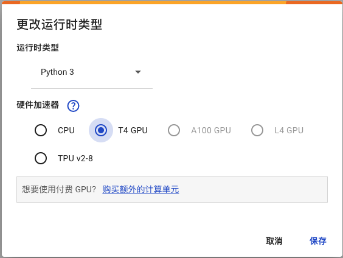

# Google Colab 使用

## 准备工作

### Colab地址

```bash
https://colab.research.google.com
```

### 申请Gmail

如果遇到选择中国地区电话号码验证不通过，可以把网页设置英文，在进行注册

### 登录Google Drive

Google Drive地址

```bash
https://drive.google.com
```

1. 使用gmail邮箱直接登陆
2. 点击new，在my drive文件夹下创建存储的文件夹


3. 进入要运行colab的文件夹

   在files文件的空白处右键，选择More--Google Colabloratory来进入colab环境，

   新建ipynb文件，修改左上角的文件名
   
4. 点击代码执行程序，选择更改运行类型，选python和GPU



5. 免费有12个小时的使用，中途是不是验证是否断开，断开虚拟机终端就终止。初次使用，一般会给一个比较好的G卡，比如如图的T4，之后一般是8G的P系列。 所以，初次使用好好体验，之后分配T4的机会就少了。


## notebook常用命令

查看操作系统版本

```bash
! lsb_release -a
```

模拟命令行输入命令

```bash
### 输入exit退出，缺点：输入不显示，是密码类型,其他操作和命令行一样
! bash
```

多个命令使用&&连接，换行要加\

```bash
! pwd && \
cd drive/MyDrive/ && \
pwd
```

查看显卡信息

```bash
! nvidia-smi
```


每一秒刷新一次显示结果

```bash
! watch -n 1 nvidia-smi
```


查看文件大小

```bash
du -sh filename
```

