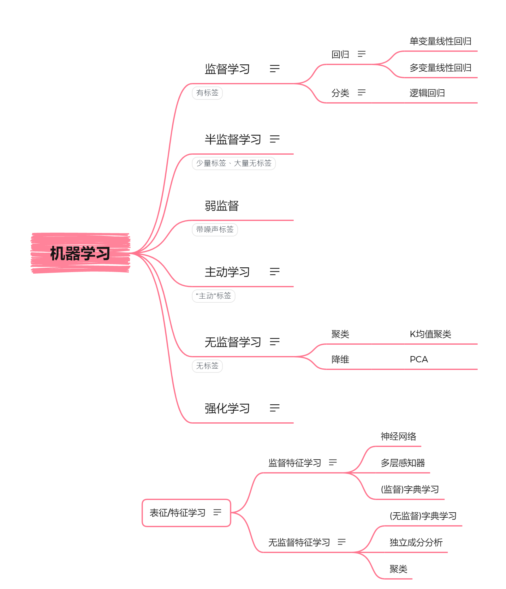
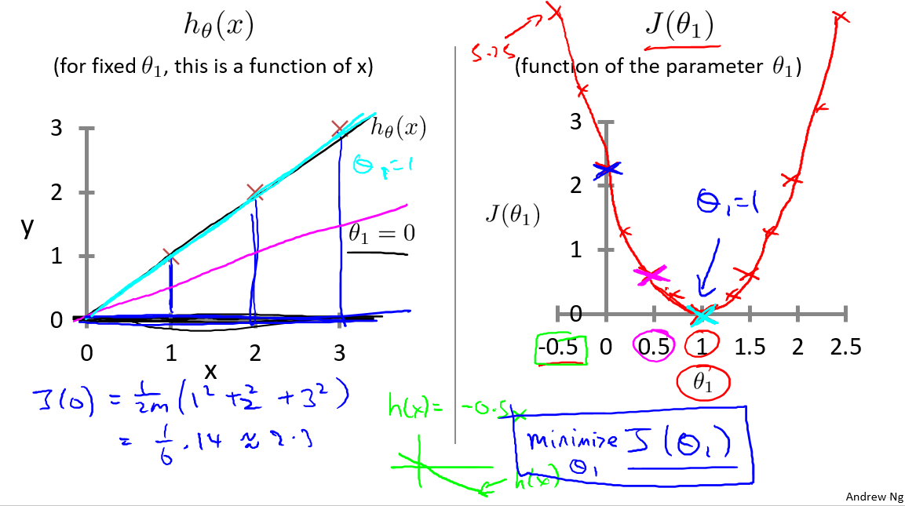
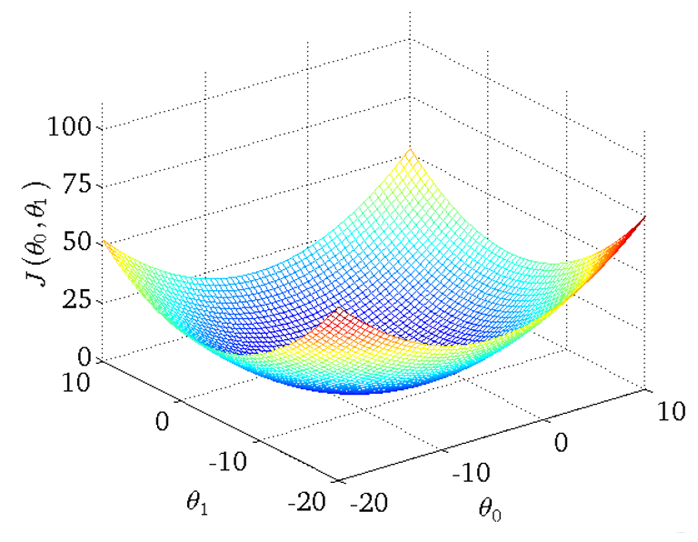
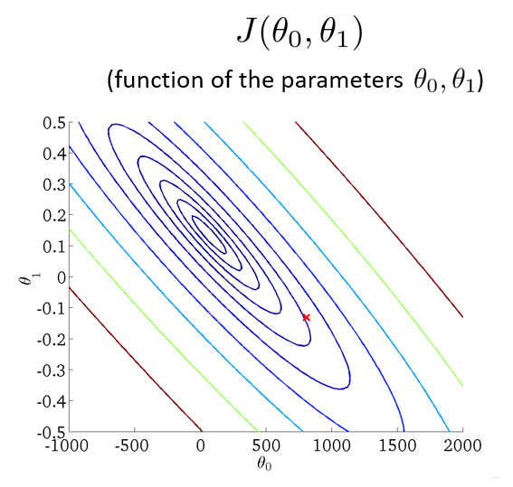
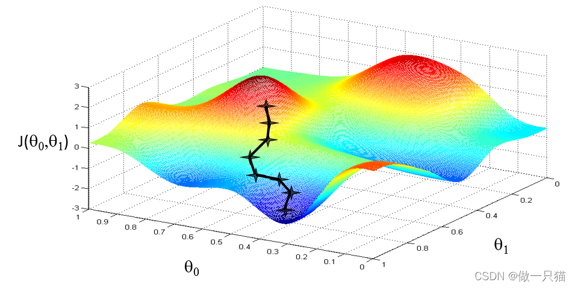
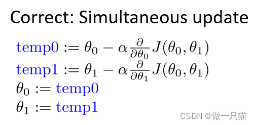
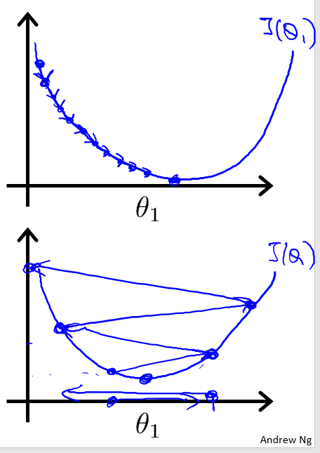
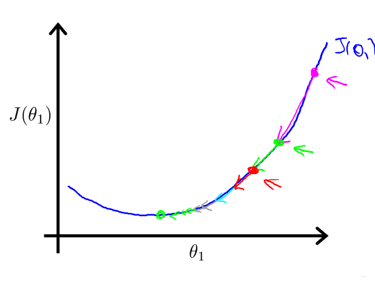
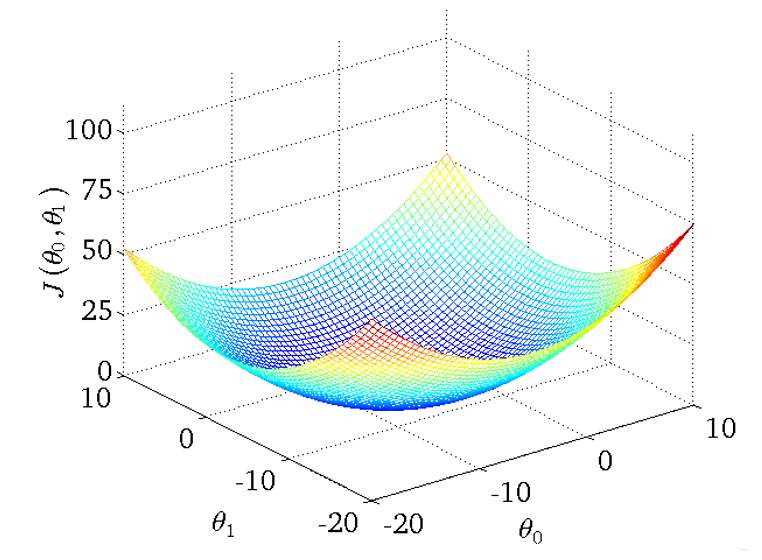

# 机器学习

## 背景

《吴恩达机器学习》

视频地址 https://study.163.com/course/courseMain.htm?courseId=1210076550

## 机器学习定义

让机器在没有明确编程的情况下进行学习（非正式定义）

定义1：机器学习是一门人工智能的科学，该领域的主要研究对象是人工智能，特别是如何在经验学习中改善具体算法的性能。

定义2：机器学习是对能通过经验自动改进的计算机算法的研究。

定义3：机器学习是用数据或以往的经验，以此优化计算机程序的性能标准。

### 机器学习问题分类

根据问题本身的特征来分类，机器学习问题可分为监督学习、无监督学习、半监督学习和强化学习。

## 监督学习

给算法一个数据集，其中包含了正确答案，算法的目的是给出更多的正确答案

特点是训练数据是有标签的，即对于每个输入都有相对应的输出，算法的目的是训练出能反映输入与输出之间的映射关系的模型。对于输出值是离散的（有限个数），称之为分类问题（Classification Problem）；对于输出值是连续的，则称之为回归问题（Regression problem）。

回归这个词的意思是，我们在试着推测出这一系列连续值属性。

分类指的是，我们试着推测出离散的输出值：0或1良性或恶性，而事实上在分类问题中，输出可能不止两个值。

## 无监督学习

只给算法一个数据集，但是不给数据集的正确答案，由算法自行分类。

特点是训练数据是没有标签的，即没有确定的输出值，就需要根据数据提取特征，这类问题的算法包括关联规则和聚类算法等。

##### 聚类算法

1. 谷歌新闻每天收集几十万条新闻，并按主题分好类
2. 市场通过对用户进行分类，确定目标用户
3. 鸡尾酒算法：两个麦克风分别离两个人不同距离，录制两段录音，将两个人的声音分离开来（只需一行代码就可实现，但实现的过程要花大量的时间）

## 单变量线性回归

#### 模型表示

$$
假设函数 hθ(x) = θ0 + θ1x
$$

因为只含有一个特征/输入变量，因此这样的问题叫作单变量线性回归问题。

#### 代价函数

代价函数

$$
J(θ0, θ1) = 1 2 m \frac{1}{2m} 
2m
1
​
 ∑ i = 1 n \displaystyle\sum_{i=1}^{n} 
i=1
∑
n
​
  ( h(x(i)) − y(i))2(m表示训练样本的数量)
$$
代价函数也被称作平方误差函数，平方误差代价函数可能是解决回归问题最常用的手段了。

目标： 最小化代价函数，即minimize J(θ0, θ1)，选择出可以使得建模误差的平方和能够最小的模型参数，得到代价函数。

##### 只考虑一个参数 θ1

#####  θ0和θ1都考虑

**将三维图平面化**

等高线的中心对应最小代价函数，就是我们的最终的结果

#### 梯度下降

**算法思路**

- 指定θ0 和 θ1的初始值

- 不断改变θ0和θ1的值，使J(θ0,θ1)不断减小

- 得到一个最小值或局部最小值时停止

  

  **梯度：** 函数中某一点(x, y)的梯度代表函数在该点变化最快的方向
  （选用不同的点开始可能达到另一个局部最小值）

**梯度下降公式**
$$
θj = θj − α ∂ ∂ θ j \frac{∂}{∂θj} 
∂θj
∂
​
  J(θ0, θ1)
$$
其中 α 为学习速率( learning rate )

θ0和θ1应同步更新，否则如果先更新θ0，会使得θ1是根据更新后的θ0去更新的，与正确结果不相符

**关于α**
如果α选择太小，会导致每次移动的步幅都很小，最终需要很多步才能最终收敛
如果α选择太大，会导致每次移动的步幅过大，可能会越过最小值，无法收敛甚至会发散

**实现原理**

- 偏导表示的是斜率，斜率在最低点左边为负，最低点右边为正。 θj减去一个负数则向右移动，减去一个正数则向左移动
- 在移动过程中，偏导值会不断变小，进而移动的步幅也不断变小，最后不断收敛直到到达最低点
- 在最低点处偏导值为0，不再移动

#### 线性回归的梯度下降 / Batch梯度下降

**公式推导：**
$$
J(θ0, θ1) = 1 2 m \frac{1}{2m} 
2m
1
​
 ∑ i = 1 n \displaystyle\sum_{i=1}^{n} 
i=1
∑
n
​
  ( h(x(i)) − y(i))2 = 1 2 m \frac{1}{2m} 
2m
1
​
 ∑ i = 1 n \displaystyle\sum_{i=1}^{n} 
i=1
∑
n
​
  ( (θ0 + θ1x(i)) − y(i))2
$$
**j = 0时表示对θ0求偏导
j = 1时表示对θ1求偏导**
$$
∂θ 0
∂J(θ 0,θ 1)
​
  = 1 m \frac{1}{m} 
m
1
​
 ∑ i = 1 n \displaystyle\sum_{i=1}^{n} 
i=1
∑
n
​
  ( (θ0 + θ1x(i)) − y(i))
$$

$$
∂θ 1
∂J(θ 0,θ 1)
​
  = 1 m \frac{1}{m} 
m
1
​
 ∑ i = 1 n \displaystyle\sum_{i=1}^{n} 
i=1
∑
n
​
  ( (θ0 + θ1x(i)) − y(i)) x(i)
$$

x(i)的 i 表示第 i 个样本

**进而更新得到：**
$$
θ0 := θ0 - α1 m \frac{1}{m} 
m
1
​
 ∑ i = 1 n \displaystyle\sum_{i=1}^{n} 
i=1
∑
n
​
  ( (θ0 + θ1x(i)) − y(i))
$$

$$
θ1 := θ0 - α1 m \frac{1}{m} 
m
1
​
 ∑ i = 1 n \displaystyle\sum_{i=1}^{n} 
i=1
∑
n
​
  ( (θ0 + θ1x(i)) − y(i)) x(i)
$$

**梯度回归的局限性：** 可能得到的是局部最优解
**线性回归的梯度下降**的函数是**凸函数**，因此没有局部最优解，只有全局最优解

**凸函数**

